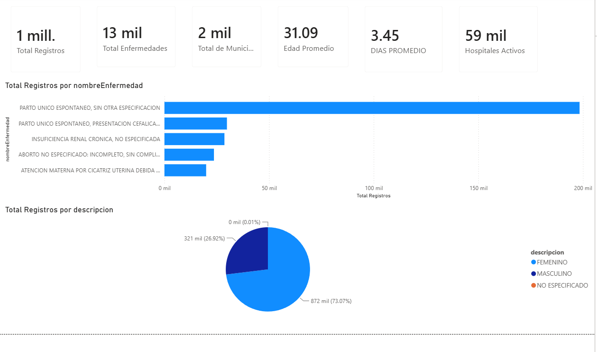
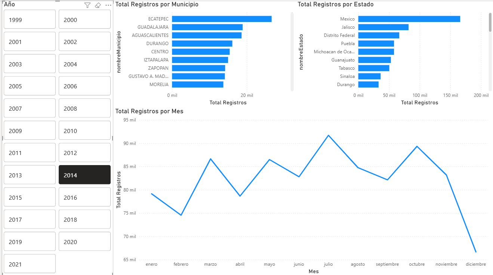

# Dashboard Epidemiológico en Power BI

## Descripción

Proyecto de análisis y visualización de datos desarrollado en Power BI utilizando un conjunto de datos ficticio con más de un millón de registros médicos.

El objetivo del dashboard es facilitar la exploración de información epidemiológica mediante indicadores clave (KPIs), análisis geográfico, distribución demográfica y tendencias temporales, permitiendo identificar patrones y apoyar la toma de decisiones basada en datos.

---

## Tecnologías Utilizadas

* Power BI
* DAX (Data Analysis Expressions)
* Power Query
* SQL Server
* Modelado Relacional

---

## Funcionalidades Implementadas

### Indicadores Clave (KPIs)

* Total de registros médicos
* Total de diagnósticos ICD
* Total de municipios registrados
* Hospitales activos
* Edad promedio de pacientes
* Días promedio de estancia

### Análisis Epidemiológico

* Diagnósticos más frecuentes
* Distribución de enfermedades
* Comparación entre diagnósticos ICD

### Análisis Demográfico

* Distribución por sexo
* Edad promedio de los pacientes

### Análisis Geográfico

* Estados con mayor número de registros
* Municipios con mayor incidencia
* Distribución territorial de la información

### Análisis Temporal

* Registros por año
* Registros por mes
* Tendencias históricas
* Evolución de los registros a través del tiempo

---

## Capturas del Proyecto

### Dashboard General

### Dashboard Temporal y Geográfico

---

## Habilidades Demostradas

* Limpieza y transformación de datos con Power Query
* Creación de medidas utilizando DAX
* Diseño de dashboards interactivos
* Modelado relacional de datos
* Creación de KPIs
* Análisis geográfico
* Análisis temporal
* Visualización de datos orientada a la toma de decisiones

---

## Principales Hallazgos

* Predominio de registros correspondientes a pacientes femeninos.
* Identificación de los diagnósticos ICD con mayor frecuencia.
* Concentración de registros en determinados estados y municipios.
* Visualización de tendencias temporales mediante filtros dinámicos.

> Nota: El pico observado en el año 2014 corresponde a una carga masiva de registros utilizada para ampliar el conjunto de datos de prueba y demostración.

---

## Nota Sobre los Datos

Los datos utilizados en este proyecto son completamente ficticios y se emplean únicamente con fines académicos, de aprendizaje y demostración.

No representan información real de pacientes, instituciones médicas ni organizaciones de salud.

---

## Autor

**Jonathan López Castro**

* GitHub: https://github.com/Jonalpz24
* LinkedIn: www.linkedin.com/in/jonalpz2427
